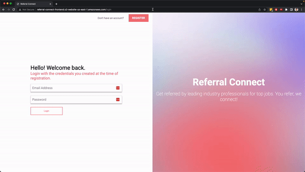
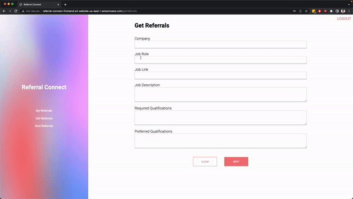
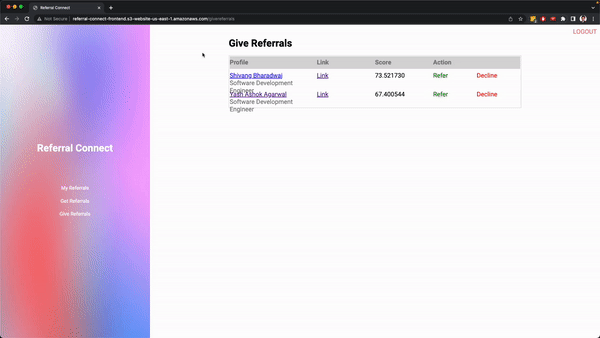
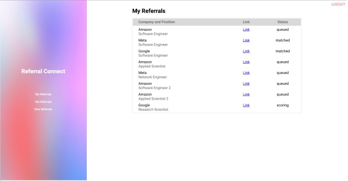

# Referral Connect Frontend
This repository contains the frontend react code for the functioning of the Referral Connect project.

# User Flows
## Register Flow

When the user registers with our application we add the user to a DynamoDB database and also add the user profile to a SQS queue. This queue is then asynchronously queried upon by a lambda that is run on a schedule of a fixed time (say 5 minutes). The profile of the user is taken and then passed to the Sagemaker model which encodes the user profile and returns the encoding back to the lambda function. This lambda function then updates the user database with the user encodings.

## Login Flow

Once the user is registered on the portal they can login using the login page. Login authentication is provided using AWS Cognito and Open Search Service domain.

## Ask Referral Flow

The user can then ask for referrals using the get referrals page. The get referrals page can take the job description, role, link, etc on the page. Once the user fills in the required information and submits the job they can see the job on the my referrals page. When a user asks for a referral for a job we add the job to our job listings database in DynamoDB and also add the job desription to a queue. This queue is then asynchronously queried upon by a lambda that is run on a schedule of a fixed time. The job description is taken and then passed to the Sagemaker model which encodes the job profile and returns the encoding back to the lambda function. This lambda function then updates the job database with the job encodings.

## Give Referral Flow

To give referrals to people looking for referrals, users can go to the give referrals tab on their navigation menu. This will open a table with the users looking for referrals in different jobs along with a match score assigned by our ranking algorithm. Then the user can decide to either provide the referral to the user or decline the referral request.

## My Referrals Flow

Users can also check out their referrals in the my referral page. Here users can also track the stage at which their application is currently at.